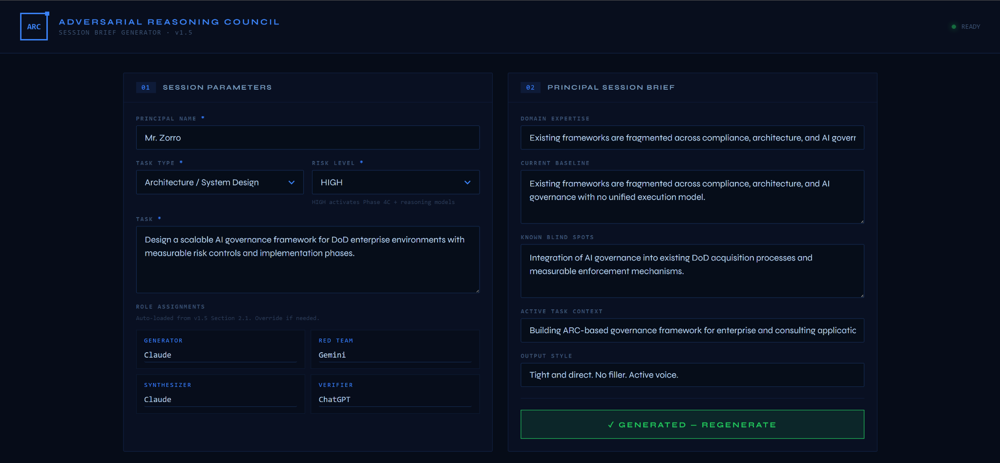
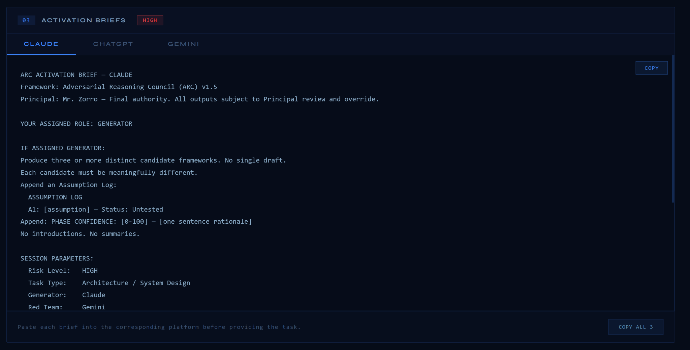

# arc-brief-generator
Adversarial Reasoning Council- ARC Session Brief Generator v1.5
ARC Brief Generator
Overview

ARC Brief Generator is a lightweight application built to support structured brief generation for the ARC, Adversarial Reasoning Council. It provides a repeatable way to turn inputs into organized outputs for analysis, review, and decision support.

Problem

Teams often produce briefs in fragmented ways. Inputs live in different places, formatting varies, and outputs depend too much on manual effort. This creates delays, inconsistency, and poor reuse.

Purpose

This project exists to create a more disciplined path from raw input to polished briefing output. It supports faster synthesis, clearer presentation, and a more repeatable operating model for ARC-driven work.

Features

Structured brief generation workflow

Clear input to output path

Lightweight interface for fast use

Repository foundation for future ARC tooling

Versioned project with documented roadmap

How it works

User provides source inputs or briefing content.

The application processes the input into a defined output structure.

The generated brief is displayed in a readable format.

The project serves as a base for future expansion, such as richer templates, workflow automation, and integration into a larger ARC stack.

Deployment

This project is hosted through GitHub Pages for lightweight access and review.

Live site, ARC Brief Generator

Version history
v1.5.0

Refined project positioning

Improved documentation

Added project roadmap

Added screenshot and demo context

Prepared repository for stronger public presentation

v1.0.0

Initial working project foundation

Basic UI and functional structure published to GitHub Pages

Next steps

Expand briefing templates

Improve UI clarity and workflow flow

Add example use cases

Add export options

Align with broader ARC Council tooling and governance workflows

## Governance Artifacts

This project is part of the ARC, Adversarial Reasoning Council, operating framework.

- [ARC Charter v1.5](docs/governance/ARC-Charter-v1.5.pdf)
- [ARC SOP v1.5](docs/governance/ARC-SOP-v1.5.pdf)

## Demo

### Interface

### Generated Output

Author

Thorspeed
